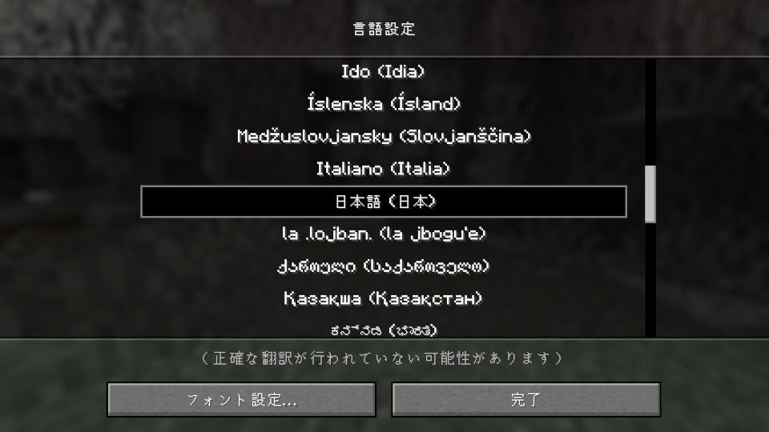

Language: 　**English**　|　[日本語](./README_jp.md)

# How to Contribute Translations

## Translation Method

This section explains how to translate FBAC avatars into your language.

### /src/index.json

- To ensure that FBAC avatars can correctly load the locale data you are creating, set the `localeVersion` field to a higher value than the current locale data version.
- Add the language you want to include in the `availableLocales` field, using the ID as the key and the display name as the value.
   You can obtain the language ID by installing Figura and running the following command in-game:

   ```mcfunction
   /figura run print(client:getActiveLang())
   ```

   For the value, enter the name as it appears on the game's language settings page.
   Do not forget to include the region notation in parentheses.

   

### /src/core/ and /src/avatars/

- Copy an existing locale data json file, rename it to "${target language ID}.json", and translate all the text inside into the target language.
- Repeat the above process for all subdirectories within "[/src/core/](./src/core/)" and "[/src/avatars/](./src/avatars/)".

## How to Test the Translations In-Game

To actually check the avatar's language display in-game, you need to set up a delivery server for the locale data in your local environment.
This explanation uses a [Python](https://www.python.org) tool, but you can use anything as long as it can build a web server.
Note that the command examples provided are based on Mac/Linux.

1. Set the current directory to "/src/".

   ```sh
   cd ${path_to_repository_root_directory}/src/
   ```

2. Enter the following command to start the web server.

   ```sh
   python -m http.server 80
   ```

3. Open "[locale.lua](https://github.com/Gakuto1112/FiguraBlueArchiveCrafters/blob/main/src/core/scripts/locale.lua)" in the FBAC core and change the URL of `REMOTE_LOCALE_ENDPOINT` to the one of your local server.

   ```lua
   local Locale = {
      ...
      REMOTE_LOCALE_ENDPOINT = "https://localhost/";
      ...
   }
   ```

4. Build the FBAC avatar and create an avatar with the changes from step 3 applied.
   For instructions on how to build the FBAC avatar, please refer to [here](https://github.com/Gakuto1112/FiguraBlueArchiveCrafters/blob/main/build_scripts/README.md).

5. In the in-game Figura settings, allow communication with the local server by, for example, registering the local server's domain (such as `localhost`) in the network filter's allowlist.

6. If you have previously cached locale data, please [clear the locale data cache from the Action Wheel](https://github.com/Gakuto1112/FiguraBlueArchiveCrafters/blob/main/README.md#action-4-reload-language-data).
